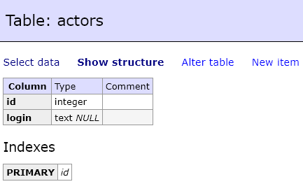
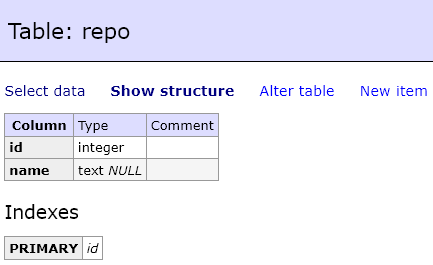
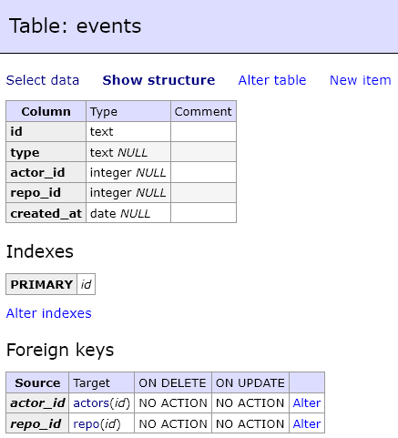
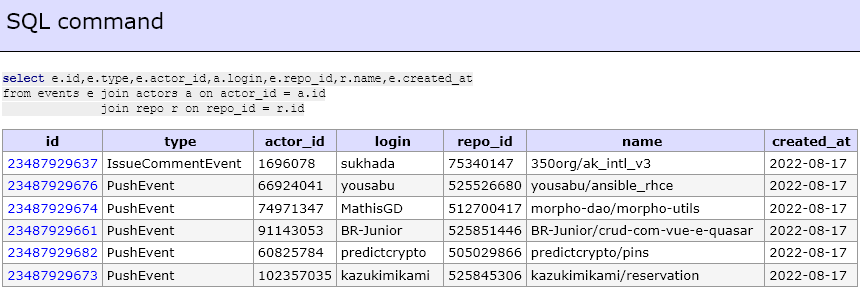

# Building a Data Modeling with Postgres (SQL)

1. ทำความเข้าใจความสัมพันธ์ของข้อมูลจากไฟล์ .json
2. สร้าง Data Model ด้วย Postgres ซึ่งเป็น Relational Database
3. เรียกใช้ container ด้วยการ Run docker compose เพื่อเข้าสู่ Web server ของ Database
4. สร้าง Table และความสัมพันธ์ด้วยไฟล์ create_tables.py (โดยจะมีการ Drop Table ก่อน หากมี Table นั้นๆ อยู่แล้ว)
5. จัดการข้อมูลที่ได้จากไฟล์ .json เข้าสู่ Table ต่างๆ ใน Database ด้วยไฟล์ etl.py
6. ทำการตรวจสอบข้อมูลใน Database บน Web server

### รายละเอียด และ ลำดับการสร้าง 3 Table ดังนี้
1. Table: actors



2. Table: repo



3. Table: events



### โดยสามารถ query ข้อมูลตามความสัมพันธ์ของทั้ง 3 Tables ด้วย SQL Command ได้ดังนี้




# Instruction
### เข้าไปที่ folder ของไฟล์ด้วยคำสั่ง

```sh
$ cd 01-data-modeling-i
```

### Install psycopg2 package

```sh
$ pip install psycopg2
```

### Running Postgres

```sh
$ docker-compose up
```

### Running Python Scripts
```sh
$ python create_tables.py
$ python etl.py
```