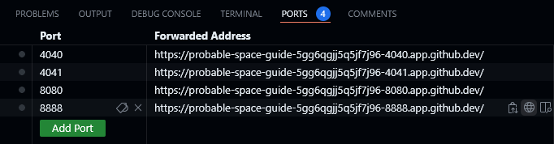
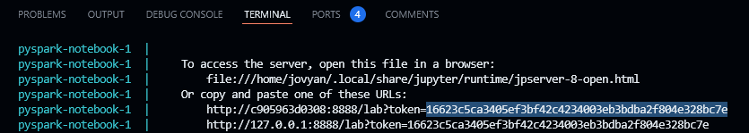
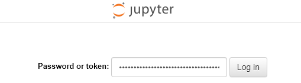
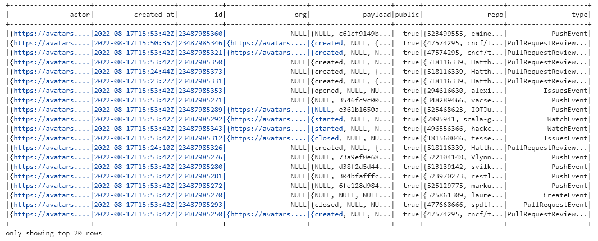

# Building a Data Lake

# Instruction
### เข้าไปที่ folder ของไฟล์ด้วยคำสั่ง
```sh
$ cd 04-building-a-data-lake
```

### เชื่อมต่อกับ Notebook ที่ติดตั้ง pyspark ไว้ จาก docker-compose.yml ด้วยคำสั่ง
```sh
$ docker compose up
```

### เข้าไปที่ jupyter server จาก port: 8888 (ที่ลูกโลก)


### ใช้ token จาก TERMINAL ที่ได้จากการ run docker ในการ Log in





# Documentaion

## etl_local.ipynb
import spark เข้ามาใช้ใน python
```sh
from pyspark.sql import SparkSession
```
ทำการเชื่อมต่อ spark 
```sh
spark = SparkSession.builder \
    .appName("ETL") \
    .getOrCreate()
```
เรียกดูข้อมูลจาก file data 
```sh
data.show()
```

หรือใช้คำสั่ง spark.sql แล้วเขียนเป็น sql เพื่อเรียกดูข้อมูลใน table ได้
```sh
data.createOrReplaceTempView("staging_events")

table = spark.sql("""
    select
        *
    from
        staging_events
""").show()
```
ได้ผลลัพธ์เหมือนนกัน




สามารถสร้าง events เพื่อเก็บข้อมูลแยกตามที่ต้องการ เช่น การสร้าง folder actors, repos 

เก็บข้อมูลเป็น file csv
```sh
output_csv = "output_csv"
output_parquet = "output_parquet"
```
```sh
table.write.partitionBy("year").mode("overwrite").csv(output_csv)
```
```sh
table.write.partitionBy("date").mode("overwrite").csv(destination)
```
```sh
destination = "events"
```
```sh
table.write.partitionBy("year", "month", "day").mode("overwrite").csv(destination)
```
```sh
table.write.partitionBy("date").mode("overwrite").csv(destination)
```
หรือ เก็บข้อมูลเป็น file parquet
```sh
table.write.partitionBy("year").mode("overwrite").parquet(output_parquet)
```