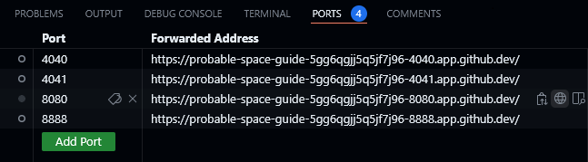
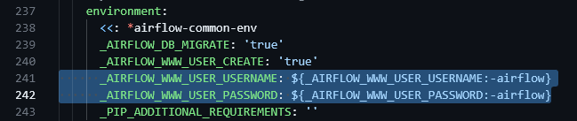
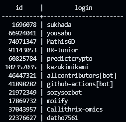
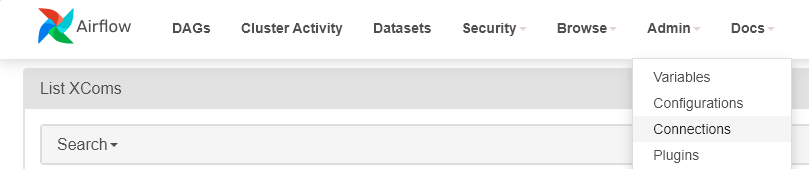
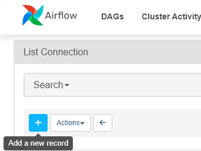
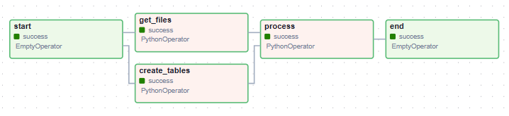

# Building a Data pipelines

# Instruction
### เข้าไปที่ folder ของไฟล์ด้วยคำสั่ง
```sh
cd 05-data-pipelines
```

### เชื่อมต่อกับ Apache Airflow โดยเริ่มจากการ run คำสั่ง
```sh
docker compose up
```

### และไปที่ Tab : PORTS ที่ port: 8080 (ที่ลูกโลก)


### ดู Username และ Password จากไฟล์ docker-compose.yaml (environment) ที่ใช้ในการ Sign In เข้า Airflow



### สามารถเรียกดู table ที่สร้างใน github ที่ Tab : terminal ได้ 
```sh
docker compose exec postgres bash
```
```sh
psql -d airflow -U airflow
```
### ตัวอย่างการเรียกดู table : actors

```sh
airlflow=# select * from actors;
```


### ปิดการทำงาน docker
```sh
docker compose down
```


# Documentation

## etl.py
กำหนดแผนภาพการทำงาน (DAG) ใน Apache Airflow โดยใช้ PythonOperator, EmptyOperator, และ _get_files, _create_tables, _process เป็นฟังก์ชันที่ใช้ในการดำเนินการของแต่ละงานที่ถูกกำหนดไว้ในแผนภาพ

กำหนดชื่อของ DAG ชื่อว่า "etl" กำหนด start_date เป็น 2024-04-21 เพื่อระบุวันแรกที่ DAG เริ่มทำงาน กำหนดรูปแบบ schedule="@daily" ซึ่งระบุว่า DAG นี้จะรันทุกวัน และกำหนด Operators ที่ต้องการ 

```sh
with DAG(
    "etl",
    start_date=timezone.datetime(2024, 4, 21),
    schedule="@daily",
    tags=["DS525"],
):

    start = EmptyOperator(task_id="start")

    get_files = PythonOperator(
        task_id="get_files",
        python_callable=_get_files,
        # op_args=["/opt/airflow/dags/data"], เป็นการส่ง path
        op_kwargs={
            "filepath":"/opt/airflow/dags/data",
        },
    )

    create_tables = PythonOperator(
        task_id="create_tables",
        python_callable=_create_tables,
    )

    process = PythonOperator(
        task_id="process",
        python_callable=_process,
    )

    end = EmptyOperator(task_id="end")

    start >> [get_files, create_tables] >> process >> end
```

ทำการสร้าง connection ติดต่อกับ Postgres โดยไปที่ Tab : Admin -> Connections



ใส่ข้อมูลดังนี้
- Connection Id : my_postgres_conn
- Connection Type : Postgres
- Host : postgres
- Database : airflow
- Port : 5432

เมื่อทำการ run สำเร็จ จะได้ graph ดังนี้

