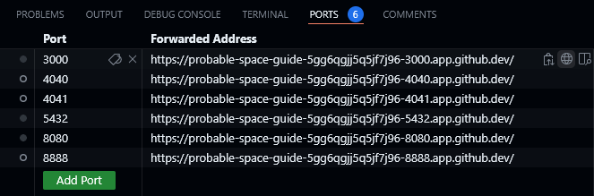
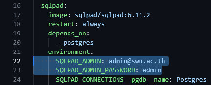
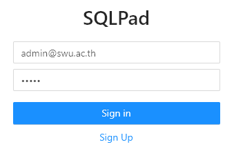
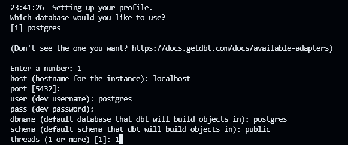

# Instruction Analytics Engineering

### เข้าไปที่ folder ของไฟล์ด้วยคำสั่ง

```bash
cd 06-analytics-engineering 
```

### เชื่อมต่อกับ postgres บน dbt โดยการ run คำสั่ง
```bash
docker compose up
```
### และไปที่ Tab : TERMINAL ที่ port: 3000 (ที่ลูกโลก)


### ดู Username และ Password จากไฟล์ docker-compose.yml ที่ใช้ในการ Sign In



### เปิดการใช้ ENV
```bash
python -m venv ENV
source ENV/bin/activate
```
### ติดตั้งการงาน dbt และ postgres
```bash
pip install dbt-core dbt-postgres
```
### สร้าง  dbt project
```bash
dbt init
```
### สร้าง project , dbname , host ,pass , port , shchema , threads , type , user



### แก้ไข the dbt profiles --> folder ds525 --> folder model ---> สร้าง file profiles.yml (เอา code ที่ได้มาเก็บไว้)

```bash
code ~/.dbt/profiles.yml
```

### Test การเชื่อมต่อกับ dbt

```bash
dbt debug
```


### เข้าไปที่ folder ของไฟล์ด้วยคำสั่ง
```bash
cd ds525
```
### code dbt 
```bash
dbt debug
dbt run
dbt test
```
### ปิดการทำงาน docker
```bash
docker compose down
```

# Documentation
1. เมื่อทำการเชื่อมต่อการใช้งานกับ dbt และ postgres เรียบร้อย 
2. เชื่อมต่อ tables 
```bash
dbt run
```
3. create  folder models --> create folder staging --> create 

- stg__jaffle_shop_customers.sql  and 
```sh
select * from {{source('jaffle_shop','jaffle_shop_customers')}}
```

- stg__jaffle_shop_order.sql
```sh
select * from {{source('jaffle_shop','jaffle_shop_orders')}}
```


4. create folder models --> create folder marts --> create jaffle_shop_obt.sql 
```sh
select 
    o.id as order_id
    , o.user_id
    , c.first_name
    , c.last_name
    , o.order_date
    , o.status as order_status

from {{ ref('stg__jaffle_shop_orders')}} as o
join {{ ref('stg__jaffle_shop_customers')}} as c 
on o.user_id = c.id
```
- ผู้ใช้สามารถดึงข้อมูลจาก jaffle_shop_obt.sql  ไปใช้งานต่อได้
