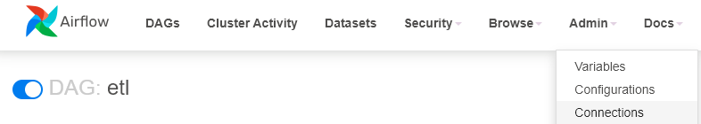

# Instruction


## Capstone Project มีการใช้ Google Cloud Platform (GCP) ดังนี้
- Cloud Storage : ต้องสร้าง bucket เตรียมไว้ก่อน
- BigQuery : ไม่ต้อง dataset เตรียมไว้ เพราะจะสร้างจาก etl.py ใน dags ผ่าน Airflow
- Private key : ต้องสร้างเตรียมไว้ เพื่อใช้ในการ connection กับ Cloud Storage และ BigQeury 


### 0. ต้องมี Google Account ก่อน เพื่อทำการสร้าง Project บน GCP


### 1. สร้าง Project บน GCP
- เข้าใช้งาน GCP โดย Cloud Console และเลือก Select a project

    

- จะมีหน้าต่างใหม่ กด NEW PROJECT

    
 
- กรอกข้อมูล กดปุ่ม CREATE 

    

- สร้าง Project เสร็จเรียบร้อย จะใช้ข้อมูลจาก Project ID สำหรับ Capstone Project นี้

    


### 2. สร้าง Bucket บน Cloud Storage
- ไปที่ Cloud Storage -> Bucket

    

- กด + CREATE

    

- กรอกข้อมูลและกดปุ่ม CONTINUE ทีละขั้นตอน โดยกรอกข้อมูลตามรูปด้านล่างนี้ และกดปุ่ม CREATE

    


### 3. สร้าง Private key file 
- ไปที่ IAM & Admin -> Service Accounts

    

- กด + CREATE SERVICE ACCOUNT

    

- ส่วนของ 1. Service account details กรอก Service account name เป็นอะไรก็ได้ และกดปุ่ม CREATE AND CONTINUE
- ส่วนของ 2. Grant this service account access to project ให้สร้าง role ตามรูปด้านล่างนี้ และกดปุ่ม CONTINUE
- ส่วนของ 3. Grant users access to this service account ไม่ต้องใส่อะไร และกดปุ่ม DONE

    

- สร้างเรียบร้อยแล้ว เข้า Service accounts ที่สร้างไว้ ไปที่ Tab : KEYS

    

- กด ADD KEY -> Create new key

    

- หน้าต่าง Create private key ส่วน Key type : JSON และกด CREATE

    

- Private key file จะถูก download ให้เก็บ file นั้นไว้ เพื่อใช้ใน Capstone Project ต่อไป

##
## Capstone Project

### 1. เตรียมการเพื่อสร้าง Data pipeline บน Airflow

- สร้าง folder ชื่อ 08-capstone-project เพื่อให้ทุก file และทุก folder อยู่ภายใน folder นี้
- สร้าง folder ชื่อ key ในนั้น เพื่อเก็บ Private key file (JSON) ที่ได้จากขั้นตอนการสร้าง Private key file โดยการลาก file ใส่ใน folder

    


- เข้าไปใน folder ชื่อ 08-capstone-project เพื่อสร้าง project โดย run คำสั่ง
```sh
cd 08-capstone-project
```


- สร้าง environment สำหรับการทำ project python โดย run คำสั่ง

```sh
python -m venv ENV
```
- activate เข้าไปใน ENV เพื่อเก็บ package ที่ใช้งานใน project โดย run คำสั่ง
```sh
source ENV/bin/activate
```
* จะเกิด folder ชื่อ ENV

    


- เชื่อมต่อกับ Apache Airflow โดยเริ่มจากการ run คำสั่ง
```sh
docker compose up
```

- และไปที่ Tab : PORTS ที่ port: 8080 (ที่ลูกโลก)

    

- ดู Username และ Password จากไฟล์ docker-compose.yaml (environment) ที่ใช้ในการ Sign In เข้า Airflow

    

    

- สร้าง connection เพื่อติดต่อกับ GCP บน Airflow โดยไปที่ Tab : Admin -> Connection แล้วกด ปุ่ม + Add a new record

    

    

- ใส่ข้อมูลดังนี้

    

- โดยในส่วนของ Keyfile JSON มีวิธีการใส่ข้อมูล คือ เปิดไฟล์ JSON ใน folder : Key 

    

- แล้วกด Ctrl+A (เพื่อเลือกข้อมูลทั้งหมด) แล้วกด Ctrl+C (เพื่อ Copy) 
    
    

- แล้วไปที่ช่องของ Keyfile JSON กด Ctrl+P (เพื่อวางข้อมูลที่ copy มาจากไฟล์) แล้วกดปุ่ม Save

    

    

##

### 2. ขั้นตอนการทำงาน automate ของ etl.py ที่อยู่ใน folder : dags ที่เชื่อมต่อกับ Airflow มีดังนี้

- ทำการ load file CSV จากหน้า Web: https://opendata.onde.go.th/dataset/14-pm-25 ทุกชั่วโมงแล้ว save file ที่ folder: data
- ทำการ transform ข้อมูลจากทุก file มารวมอยู่ใน file: all_data.csv ที่อยู่ใน folder: data/cleaned
- โดยมีเพิ่ม field: provice ที่แยกจาก field: area_en และเพิ่ม field: datetime จาก field: date และ time รวมกัน

    

##

- ทำการ load file ทั้งหมดขึ้น Bucket: swu-ds-525 บน Google Cloud Storage ที่สร้างเตรียมไว้ก่อนหน้านี้
- โดยแบ่งข้อมูลแยกออกเป็น folder ใน Bucket คือ pm25_raw: เก็บ file ที่ได้จาก Web และ pm25_cleaned: เก็บ file all_data.csv

    

    

##

- ทำการนำข้อมูลจาก file: all_data.csv เข้า dataset: capstone_aqgs บน BigQuery
- โดยมีการ transform แยกข้อมูลออกเป็น 2 Tables, เพิ่ม field: pollutant และทำ partition ที่ table: pm25_trans ดังนี้

    

- โดยมี Data modeling ดังนี้

    

- เมื่อ Airflow ทำงานได้ complete ตาม schedule ที่กำหนดไว้

    

    


##

### 3. สร้าง view ที่ dataset: capstone_aqgs_staging บน BigQuery โดย dbt

- Download library dbt-core dbt-bigquery เพื่อให้สามารถใช้งาน dbt และเชื่อมต่อกับ BigQuery ได้ โดย run คำสั่ง
```sh
pip install dbt-core dbt-bigquery
```

- สร้าง project profile dbt โดย run คำสั่ง
```sh
dbt init
```
- และมีการกรอกข้อมูลตามรูปด้านล่าง

    


- สร้าง file: profiles.yml ใน folder: ds525_capstone/models และ copy ข้อมูลทั้งหมดจาก code ด้านล่าง มาใส่ใน file: profiles.yml
- หลังจากนี้ จะทำงานภายใน folder: ds525_capstone
```sh
code /home/codespace/.dbt/profiles.yml
```
- ข้อมูลใน file: profiles.yml ใน folder: ds525_capstone/models

    


- ทดสอบการ connection กับ BigQuery โดย run คำสั่ง
```sh
dbt debug
```
- ถ้าทดสอบผ่านทั้งหมดจะแสดง All checks passed!

    

- สร้าง folder: staging และสร้าง file: _src.yml ใน folder และให้ใน file มีข้อมูลดังนี้ (เพื่อใช้อ้างอิง source data)

    

- ข้อมูลจาก source tables จะถูกนำมาใช้ในการสร้าง view ตามความต้องการ และเพื่อป้องกันการเปลี่ยนแปลงของ source table จาก user สามารถกำหนดการสร้าง view หรือ table ได้จาก file: dbt_project.yml ดังนี้

    

- การ transform source data ด้วยการใช้ dbt จะอ่านจาก file ที่มีนามสกุล .sql ที่อยู่ใน folder: models ทั้งหมด (หากมีหลาย folder ภายใต้ folder: models)

    

- script sql จาก file: view_station_avg_rpt.sql

    

- จากนั้น run คำสั่งด้านล่าง เพื่อเป็นการทดสอบและการสร้าง view
```sh
dbt run
dbt test
```

- จะได้ view บน dataset: capstone_aqgs_staging ตามรูปด้านล่าง

    

##

### 4. ใช้ view ที่สร้างขึ้นด้วย dbt ทำ visualzation ด้วย tableau 

- https://public.tableau.com/views/Book2_v2023_3_17150912236310/Dashboard1?:language=th-TH&publish=yes&:sid=&:display_count=n&:origin=viz_share_link

    

- top n จังหวัดที่มี avg PM2.5 สูงสุด
- สถานีใน top n จังหวัด ( ดูว่าเพียงพอต่อการเฝ้าระวังหรือไม่ )
- เช็คค่า PM2.5 กับมาตราฐานที่ WHO กำหนด โดยแสดงในเชิง icon สัญลักษณ์ฃ
